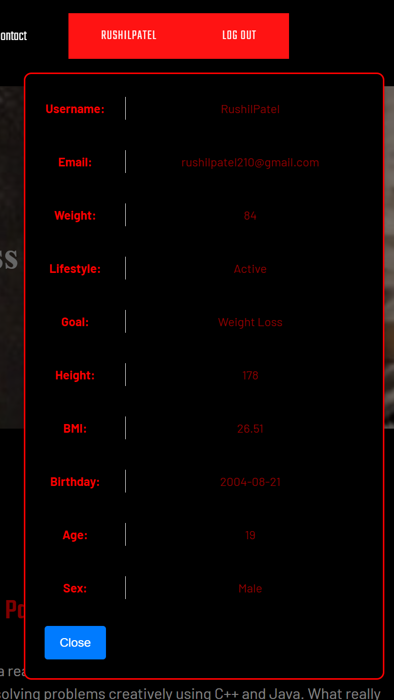
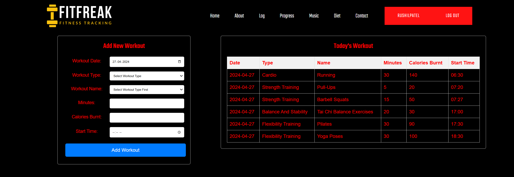
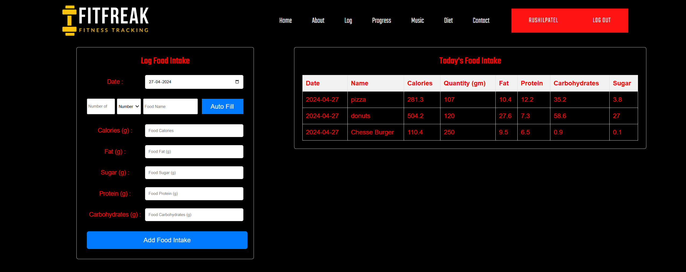
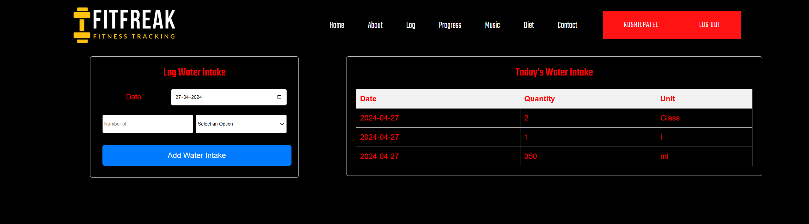
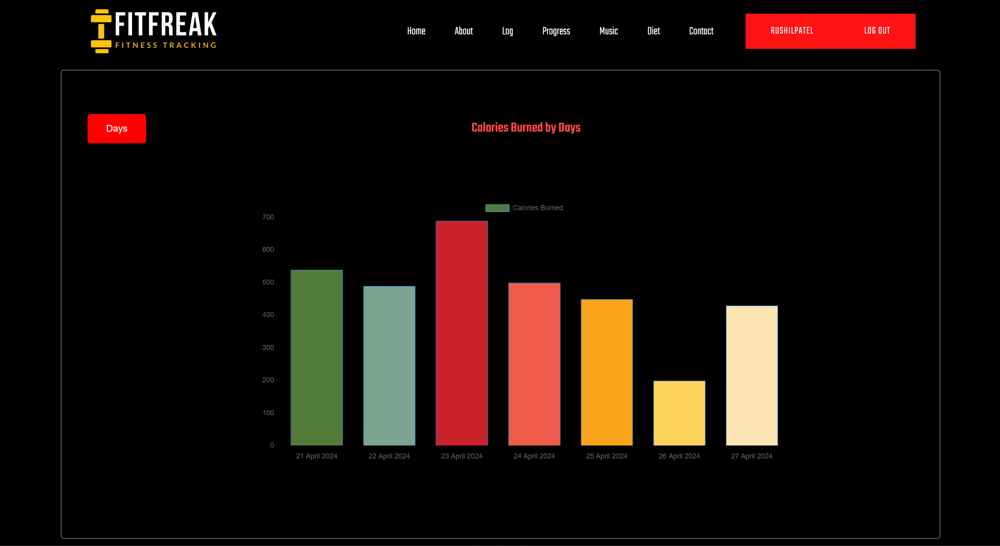
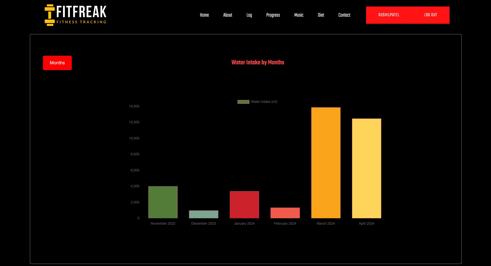
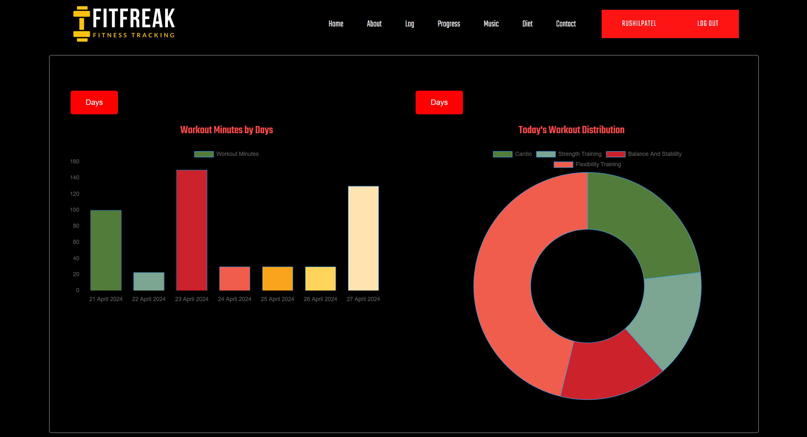
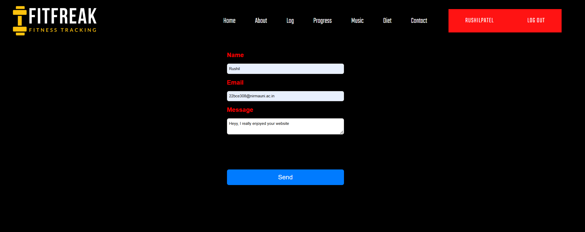
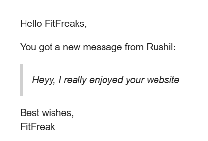

# Fitness Tracker

The Fitness Web Tracker is a comprehensive fitness tracking tool designed to cater to users of all fitness levels and backgrounds. With features like exercise tracking, nutritional monitoring, goal setting, and community engagement, it offers a holistic approach to health and wellness management.

Built upon the MERN stack (MongoDB, Express.js, React.js, and Node.js), the application delivers a seamless and intuitive user experience, empowering users on their fitness journey.

## Design and Architecture
The Fitness Web Tracker's architecture includes:

- Frontend: React.js for UI components and Redux/Context API for state management.
- Backend: Node.js and Express.js for server-side logic, MongoDB for data storage.
- Services: User Authentication, Workout Tracking, Nutritional Tracking, Community Engagement, Analytics, and Reporting.
- Deployment: Cloud platforms for scalability, Docker for containerization, Kubernetes for orchestration. 

## Authors

| Name                             | ID           | Contributions                                                        |
|----------------------------------|--------------|----------------------------------------------------------------------|
| **Aditya Madhav**                | 2023MT93030  | Design, UI, Database, Backend Guidance, Documentation & Integration  |
| **Devireddy Vasantha Pallavi**   | 2023MT93025  | Design, Backend, Documentation & Integration                         |
| **Sweety**                       | 2023MT93028  | Design, UI, Documentation & Integration                              |

## Images

### Home Page

### User Details

### Workout Log

### Food Log

### Water Log

### Calories Burnt

### Water Intake

### Workout History

### Contact

### Contact's Reply Mail

